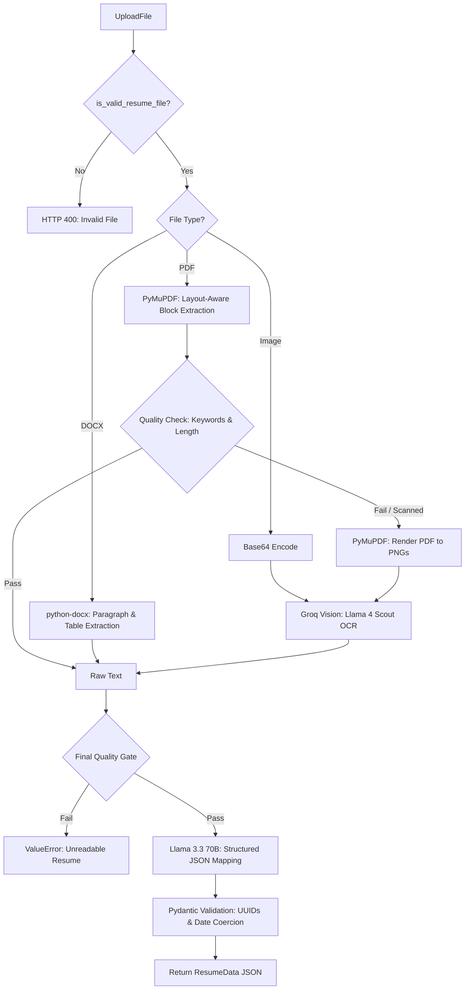
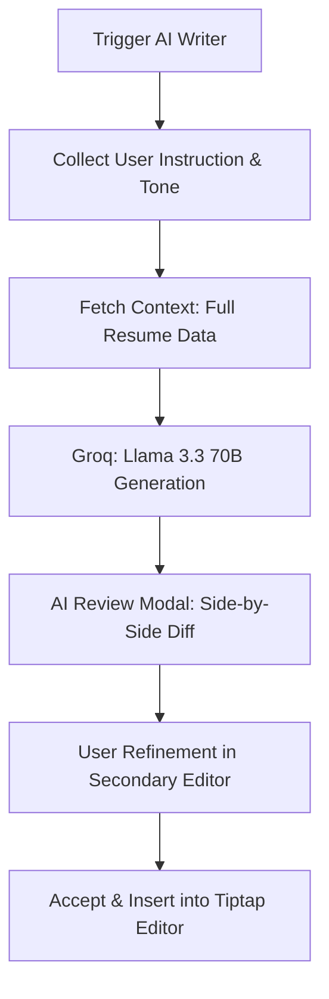
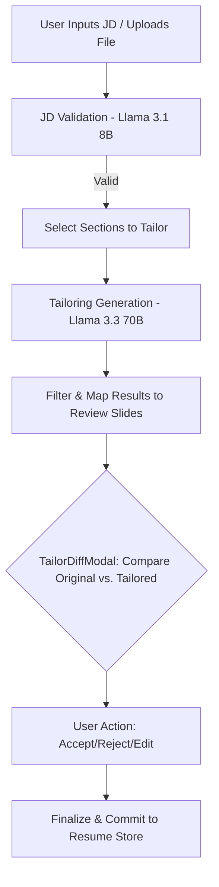
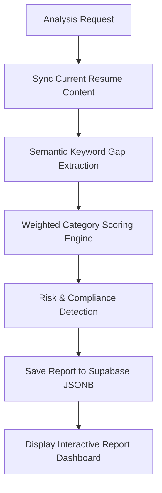
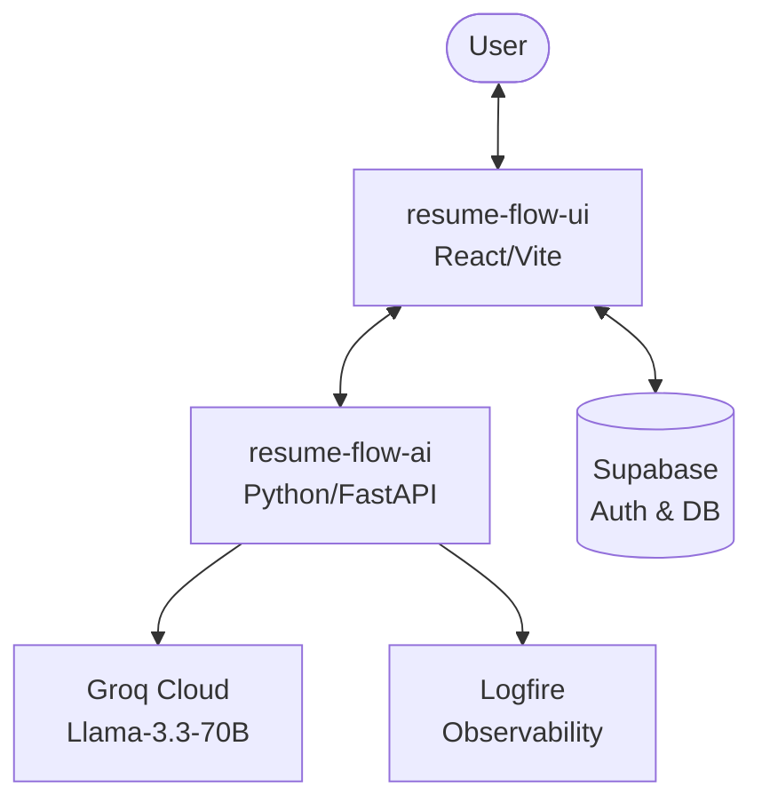

# Resume Flow 🚀

An intuitive, modern, and AI-powered resume builder ecosystem designed to streamline your job application process. Craft the perfect resume with real-time feedback, AI-driven content generation, and ATS optimization.

---

## 🌟 Key Features

### 🎨 The Intelligent Builder
*   **Real-Time High-Fidelity Preview:** Utilizes `@react-pdf/renderer` for dynamic PDF generation and `react-pdf` (powered by `pdf.js`) for browser-side rendering.
*   **Adaptive View Modes:** Includes **Fit Width** and **Fit Height** modes with precise zoom controls (50% to 150%) and an immersive fullscreen mode.
*   **Dynamic Content Management:** Seamlessly reorganize sections using a vertical drag-and-drop interface powered by `@dnd-kit`.
*   **Intelligent Auto-Save:** Background synchronization logic (30s interval) that upserts state to **Supabase**, paired with a local session-storage fallback.
*   **Professional Theme Engine:** Curated color grids, custom hex pickers, and 10+ professional font pairings.
*   **Rich Text Integration:** Uses **Tiptap** for clean, semantic HTML editing in summaries and descriptions.

### 🧠 Intelligence Engine
The core of Resume Flow is a sophisticated intelligence engine powered by **Groq (Llama 3.3/3.1)** and custom extraction pipelines.

#### 📄 A. Resume Parser (The Ingestion Engine)
Converts unstructured documents (PDF, DOCX, Images) into a strict, frontend-compatible JSON schema using layout-aware extraction and vision fallback.



#### ✍️ B. AI Writer (Content Architect)
Provides contextual generation for professional summaries and impactful bullet points, maintaining consistency across the entire resume.



#### 🎯 C. AI Tailor (Strategic Optimizer)
Automatically adjusts resume content to target specific job roles using the STAR method, with a strict "Zero Hallucination" policy.



#### 🔍 D. ATS Optimizer (Match Intelligence)
A 9-category weighted scoring algorithm that identifies keyword gaps and formatting risks.



---

## 🏗️ Ecosystem Architecture



---

## 🛠️ Integrated Tech Stack

### Frontend (`resume-flow-ui`)
- **Framework:** React 18, Vite, TypeScript
- **Rich Text:** Tiptap
- **Styling:** Tailwind CSS, Framer Motion
- **State:** Zustand, React Query
- **PDF:** @react-pdf/renderer

### AI Service (`resume-flow-ai`)
- **Backend:** Python 3.9+, FastAPI
- **Extraction:** PyMuPDF, python-docx
- **Inference:** Groq Cloud (Llama 3.3/3.1)
- **Observability:** Logfire

---

## 🚀 Unified Quick Start

To run the full suite locally, follow these steps.

### 1. Prerequisites
- **Node.js** (v18+)
- **Python** (v3.9+) & [uv](https://docs.astral.sh/uv/)
- **Groq API Key** & **Logfire Token**
- **Supabase Account**

### 2. Environment Setup

**Frontend (`resume-flow-ui/.env`):**
```env
VITE_SUPABASE_URL=your_url
VITE_SUPABASE_ANON_KEY=your_key
```

**AI Service (`resume-flow-ai/.env`):**
```env
GROQ_API_KEY=your_key
LOGFIRE_TOKEN=your_token
```

### 3. Running the Application

**Start AI Service:**
```bash
cd resume-flow-ai
uv sync
uv run uvicorn app.main:app --reload --port 8001
```

**Start Frontend:**
```bash
cd resume-flow-ui
npm install
npm run dev
```

---

## 📄 License
Distributed under the MIT License. See LICENSE in the root directory for more information.
