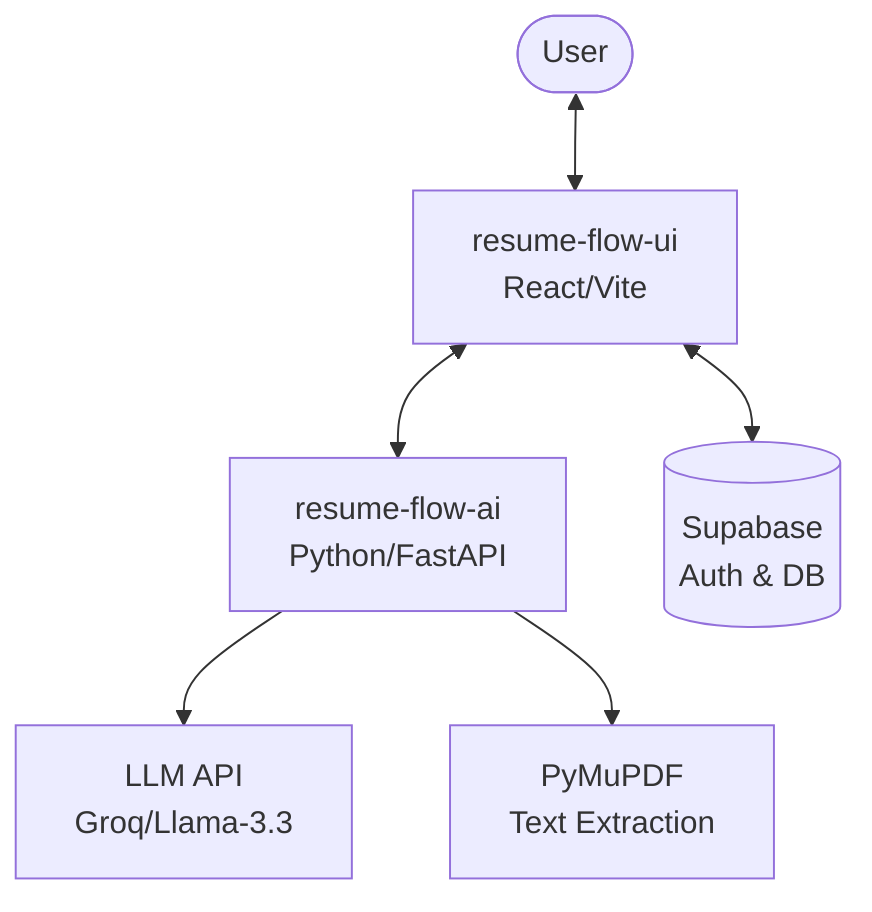

# Resume Flow 🚀

An intuitive, modern, and AI-powered resume builder ecosystem designed to streamline your job application process. Craft the perfect resume with real-time feedback, AI-driven content generation, and ATS optimization.

---

## 🌟 Key Features

### 🎨 The Intelligent Builder
*   **Real-Time High-Fidelity Preview:** Utilizes `@react-pdf/renderer` for dynamic PDF generation and `react-pdf` (powered by `pdf.js`) for browser-side rendering.
*   **Adaptive View Modes:** Includes **Fit Width** and **Fit Height** modes with precise zoom controls (50% to 150%) and an immersive fullscreen mode.
*   **Dynamic Content Management:** Seamlessly reorganize sections using a vertical drag-and-drop interface powered by `@dnd-kit`.
*   **Intelligent Auto-Save:** Background synchronization logic (30s interval) that upserts state to **Supabase**, paired with a local session-storage fallback.
*   **Professional Theme Engine:** Curated color grids, custom hex pickers, and 10+ professional font pairings with granular line-height and typography controls.
*   **Rich Text Integration:** Custom Quill-based editors for professional summaries and experience descriptions.

### 🧠 AI Intelligence Suite
*   **AI Resume Writer:** Surgical content generation for professional summaries and impactful bullet points.
*   **AI Tailor:** Automatically adjust your resume content to target specific job roles with interactive side-by-side "Original vs. AI Improved" diffs.
*   **AI Content Review:** Instant feedback on resume quality, clarity, and impact with recruiter simulation (6-second first impression).
*   **Performance Backend:** Powered by the **Groq Inference API** (Llama 3.3/3.1) and **HuggingFace**, utilizing layout-aware PDF extraction.

### 🔍 ATS Optimization Ecosystem
*   **ATS Checker & Scoring:** Multi-dimensional scoring (0–100) across 9 categories: Formatting, Keywords, Experience, Impact, and more.
*   **Keyword Intelligence:** Semantic identification of **Strong Keywords** vs. **Missing Keywords** required for target roles.
*   **Risk Detection:** Technical analysis to identify formatting "Risks" that could hinder ATS readability.
*   **Historical Reports:** Centralized storage of all analysis results in Supabase to monitor improvement over time.

### 🗂️ Comprehensive Management
*   **User Dashboard:** Manage multiple resumes with visual thumbnails (automatically synced to Supabase Storage).
*   **Resume Import:** Upload existing PDFs and convert them into editable resumes via AI parsing.
*   **Secure Authentication:** Robust user accounts and data persistence via **Supabase**.

---

## 🏗️ Ecosystem Architecture



| Service | Description | Tech Stack | Repository |
| :--- | :--- | :--- | :--- |
| **Frontend** | Modern, interactive resume builder and dashboard. | React, Vite, Zustand, Tailwind | [View Service](./resume-flow-ui) |
| **AI Service** | Intelligent parsing, rewriting, and ATS analysis engine. | Python, FastAPI, PyMuPDF | [satviksrivatsav/resume-flow-ai](https://github.com/satviksrivatsav/resume-flow-ai) |

---

## 🛠️ Integrated Tech Stack

### Frontend (`resume-flow-ui`)
- **Framework:** React 18, Vite, TypeScript
- **Styling:** Tailwind CSS, Framer Motion
- **Components:** Radix UI / shadcn/ui
- **State:** Zustand, React Query
- **PDF/Docx:** @react-pdf/renderer, docx, pdf.js

### AI Service (`resume-flow-ai`)
- **Backend:** Python 3.9+, FastAPI
- **Extraction:** PyMuPDF (fitz)
- **AI Models:** Llama 3.3/3.1 (via Groq/HuggingFace)
- **Dependency Management:** [uv](https://docs.astral.sh/uv/)

### Backend & Infrastructure
- **Auth & Database:** Supabase
- **Storage:** Supabase Storage (Resume Thumbnails)

---

## 🚀 Unified Quick Start

To run the full suite locally, follow these steps.

### 1. Prerequisites
- **Node.js** (v18+)
- **Python** (v3.9+)
- **HuggingFace / Groq Token** (Set in AI service `.env`)
- **Supabase Account** (Set in UI service `.env`)

### 2. Installation & Running

#### Frontend (UI)
```bash
cd resume-flow-ui
npm install
npm run dev
```

#### AI Service
```bash
# Clone the companion repository
git clone https://github.com/satviksrivatsav/resume-flow-ai.git
cd resume-flow-ai

# Install dependencies and run
uv sync
uv run uvicorn app.main:app --reload
```

---

## 📄 License
Distributed under the MIT License. See `LICENSE` in the root directory for more information.
